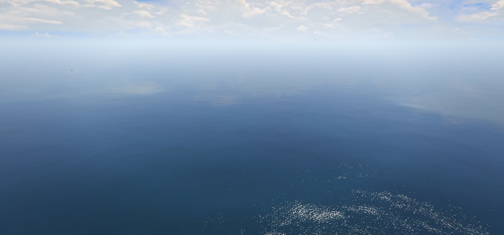
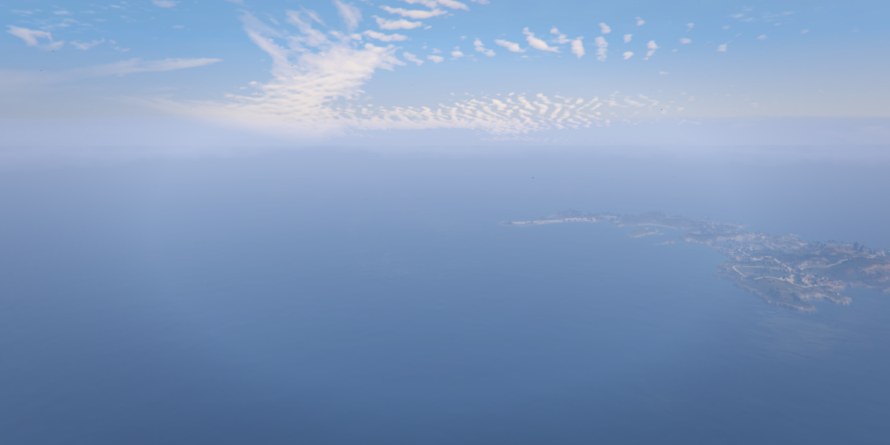
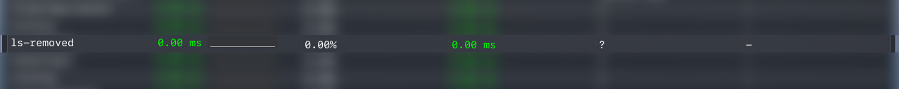

# Cayo Perico Loader - Ultimate Edition. Lightweight, Customizable, Upgraded


The resource should be self-explanatory and will probably come in handy for anyone wanting to use other game maps instead of the default one.

The first version used `replace_level_meta` which didn't allow later injection of DLC files directly from the client's game files, and therefore, if you wanted to use the previous version of this resource with Cayo Perico, you would have streamed all of its assets, which are around 3GB. I really hope I don't have to tell you this is not a good approach, and rather counterintuitive (trying to load something that already exists in the client's game files).

As such, I decided to drop the replacement level meta approach and look for another method.  
# Images





Example: LS-Removed running with Cayo Perico Ultimate, loaded via IPLs, no LS LODs visible.


# Features
- Supports IPL map loaders such as [Cayo Perico Ultimate](), or any other loader.
- Should work with any addon map such as Roxwood or Las Venturas (in theory since I don't have access to paid maps). 
- Removed all LODs.
- Removed LOD light pollution at night.
- Removed traffic path nodes (waypoints placed where LS used to be won't draw a GPS route). 
- Removed LS peds and vehicles.
- Fixed water pollution textures around LS.
- Other ymaps/ybns other than the LS map are left intact, meaning that you can spawn, without any problems, North Yankton or the aircraft carrier, for example.
- All props are still available. 
- UI menu graphics are left untouched and should work normally. Esentially, everything work normally, just the basegame map removed :)

# Config
```lua
config.custom_water_name = 'ls_water'   -- set to nil to disable, or set to a key in config.custom_water to load a custom water file
config.custom_water = {
    ['ls_water'] = {
        resource_name = GetCurrentResourceName(), path = 'data/water.xml'
    },
    ['cayo_water'] = {
        resource_name = GetCurrentResourceName(), path = 'data/water_ls_cayo.xml', deep_ocean_scaler = 0.0, global_water_type = 1
    },

    -- example custom water config, you can use water from another resource or with different settings
    -- by adding a new entry here and setting config.use_custom_water to the key of that entry:
    -- 
    -- Parameters: 
    --['your_water_name'] = {
    --    resource_name = 'your_resource_name', path = 'path/to/your/water.xml', deep_ocean_scaler = 0.0, global_water_type = 1
    --}
}
```

# Known Limitations
- Does not work with the Rockstar Editor (at least from my testing)
- For servers that don't remove default GTA 5 peds: sometimes peds or animals reappear, I have no idea why, I tried everything I could think of and couldn't get my head around it.
- When high enough in the sky, the world horizon is clipped in order to hide farlods.ydd and produces an unnatural clipping of the ocean. From my extensive testing, this was the only way to remove/hide farlods.ydd.  

# Performance
This resource basically takes up no CPU cycles, as it doesn't use any infinite loops, therefore it has a CPU time of 0.00ms. This resource does however stream many (10000+), albeit small, collision (.YBN) files, and therefore some slight lag spikes should be expected until the client downloads and **caches** the files. After caching, lag spikes should not reappear. 


# Support and bug-reporting
If you require any help, have found a bug with this resource, or have a feature request, either leave a reply in this thread, in my forum PMs or Discord DMs. I read and reply to everything. As always, feedback is very much appreciated.

# My other resources
[Carrier Operations](https://forum.cfx.re/t/release-carrier-operations-working-aircraft-carrier-mechanics/5180887) - Working aircraft carrier mechanics.
[Cayo Perico Loader - Ultimate Edition]() - Lightweight, Customizable IPL Cayo Perico loader.
[Vehicle Helmets](https://forum.cfx.re/t/release-vehicle-helmets-wear-hats-and-helmets-inside-vehicles/5181880) - Wear hats and helmets inside vehicles.